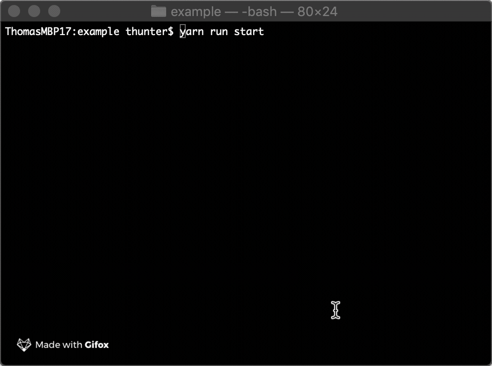

# Currnt
NodeJS library allowing multiple executions at once to return a single array obj.

## Aims
- Multiple tasks running at the same time, same function different inputs.
- Results of the task are collated into a single array, order is not important.
- Console shows the output of the current running tasks.
- Limits to how many tasks running at once.

# Example.
There is an example project in the project (`/example`) view the [README.md](example/) to get started.

# Demo
